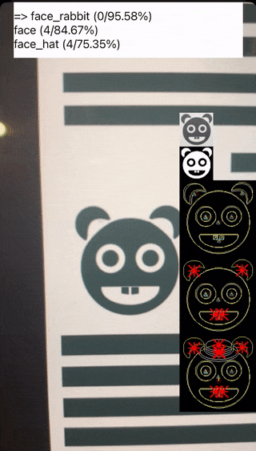

# OpenCVRecognizerExample

Example of scanner with OpenCVRecognizer: 
https://github.com/Jnis/OpenCVRecognizer

(image scanner, image detection, image recognition)

<table>
<tr>
<td></td>
</tr>
</table>

# Installing
1) Add https://github.com/Jnis/OpenCVRecognizer repo as a submodule 
2) Drag and drop submodule folder into Xcode project (add as a group). 
(Leave `src` and `ios` folders only)
3) Change OCVContour.cpp and OCVContour.cpp file type to "Objective-C++ Processed Source" 
(File Inspector/  Top right corner )
4) Add next import into your XXX-Bridging-Header.h file:
```
#import "OCVProcessorAdapter.hpp"
```
5) Download and add latest version of OpenCV into your project: https://opencv.org/releases/

Ps1: Update .plist file with "Privacy - Camera Usage Description"

Ps2: add "arm64" into Excluded Architectures for Debug/Simulator 

# Usage
See 'ScannerViewController.swift' in Demo project.

# License 
MIT